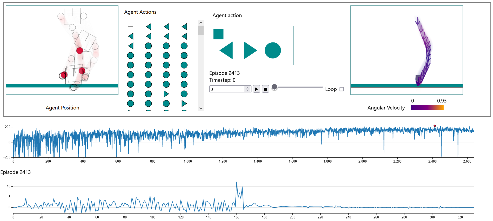

# Lunar Lander Dashboard



[Demo video on YouTube](https://youtu.be/ZPL_KyHYTnk)

The aplication is a simple web server, it serves pages that load data from a CSV file. [Online here.](https://tiagodavi70.github.io/lunarlander/)

For local instances, you can download the [RLLunarLanding2023.3 dataset](https://uapt33090-my.sharepoint.com/:f:/g/personal/tiagodavi70_ua_pt/EnQ2j9__CvRMqzTXv_GpLYUBkJXF9PhR9QTPvn1aDrLh_A?e=r9JgPO) to the `data` folder and change some parts of the code.

## Development
* Start preprocess environment (only for test and debug with raw files that are not in this repo)
```
conda activate lunarlandervis
jupyter lab --allow-root
```

* Update chart-components  
```
git submodule foreach git pull origin main
```